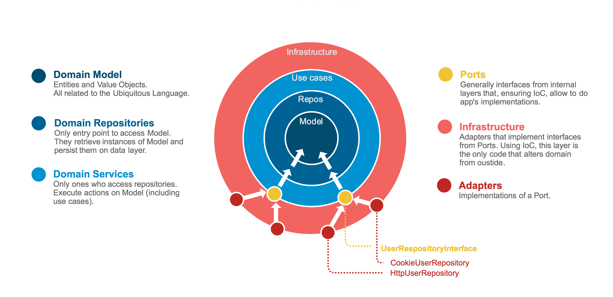

## Architecture

### Port/Adapter Architecture

As an [onion](https://www.youtube.com/watch?v=pL9XeNjy_z4), the code is segregated in 4 concentric layers. Each layer can only access its wrapped layer, as you can see in this figure:

The domain is based on the [Dependency Inversion Principle](https://en.wikipedia.org/wiki/Dependency_inversion_principle), which allows inner layers to define their expected interface as **ports**. Outer code (app implementations) must comply with this interface with **adapters** to fulfill the needs of a specific environment/platform.

From outside of the domain, only **UseCases** (provided by the **EntryPoint** ) can be accessed to execute operations of the domain.

----

## Building Blocks

The majority of patterns used to compose the domain are based on [Domain Driven Design](https://js-training.now.sh/slides/DomainDrivenDesign.md#/3)

